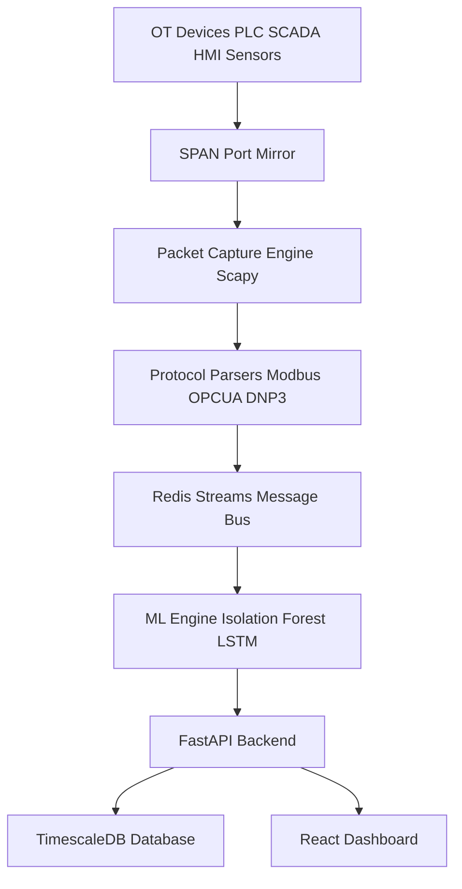

# 🛡️ Suraksha — OT Network Intrusion Detection System

Suraksha is a lightweight passive Intrusion Detection System for OT/ICS networks.  
It monitors Modbus TCP, OPC-UA, and DNP3 traffic using behavioral ML without sending any packet to the OT network.

---

## 🚨 Problem

Industrial networks use outdated protocols without authentication or encryption.  
Attackers can send malicious commands directly to PLCs and disrupt operations.

---

## 🎯 Solution

Suraksha passively monitors traffic, detects anomalies using ML, and visualizes threats via a real-time dashboard.

---

## 🏗️ System Architecture



---

## ⚙️ Tech Stack

### Frontend

| Tech | Why Used |
|------|---------|
| React | Real-time dashboard UI |
| Vite | Fast build system |
| D3.js | Topology visualization |
| Recharts | Charts |
| Tailwind | Styling |

---

### Backend

| Tech | Why Used |
|------|---------|
| FastAPI | Async backend |
| Scapy | Packet capture |
| Redis | Streaming pipeline |

---

### Database

| Tech | Why Used |
|------|---------|
| TimescaleDB | Time-series storage |

---

### ML Models

| Model | Purpose |
|-------|--------|
| Isolation Forest | Point anomaly detection |
| LSTM Autoencoder | Sequence anomaly detection |

---

## 🚀 Getting Started

### Frontend
```
npm install
npm run dev
```

### Backend
```
pip install fastapi uvicorn scapy redis sklearn torch
uvicorn main:app --reload
```

---
